# End_to_End_RAG 系統架構文檔

本文檔詳細說明 End_to_End_RAG 專案的系統架構、模組關係和資料流。

## 目錄

- [系統整體架構](#系統整體架構)
- [CLI 旗標與 Graph 執行路徑對照](#cli-旗標與-graph-執行路徑對照)
- [核心模組說明](#核心模組說明)
- [資料流圖](#資料流圖)
- [類別關係圖](#類別關係圖)
- [模組化 Pipeline 架構](#模組化-pipeline-架構)
- [儲存管理架構](#儲存管理架構)
- [評估系統架構](#評估系統架構)

---

## 系統整體架構

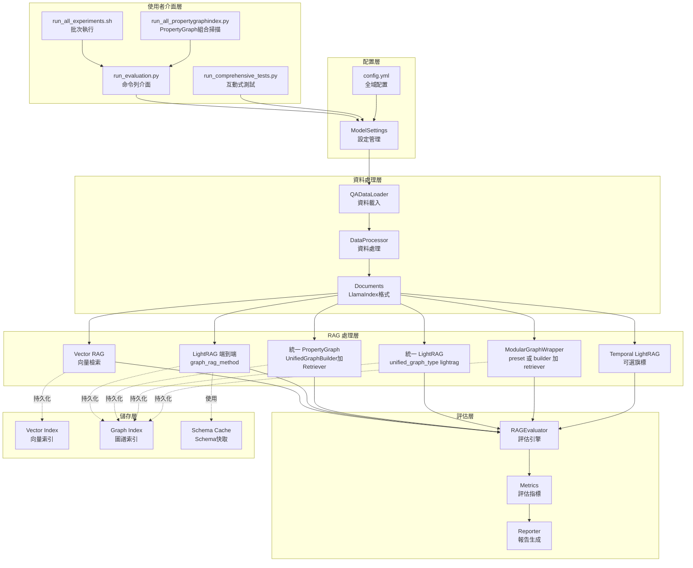

**說明**：舊版端到端 `--graph_rag_method propertyindex`／`dynamic_schema`／`autoschema` 已棄用（僅印遷移提示），評估主路徑為上圖之 `UnifiedPG` 或模組化組合。細節見下節與 [README.md](README.md)（文檔索引）。

---

## CLI 旗標與 Graph 執行路徑對照

| 路徑 | 主要旗標 | 實作入口（`run_evaluation.py`） |
|------|-----------|-------------------------------|
| LightRAG 端到端 | `--graph_rag_method lightrag`（及 `--lightrag_mode` 等） | `setup_lightrag_pipeline` |
| 統一 PropertyGraph | `--unified_graph_type property_graph`、`--pg_extractors`、`--pg_retrievers`、`--pg_combination_mode` | `setup_unified_graph_pipeline` → `UnifiedGraphBuilder` + `UnifiedGraphRetriever` → `ModularGraphWrapper` |
| 統一 LightRAG | `--unified_graph_type lightrag` | 同上，`builder_type=lightrag` |
| 模組化 Builder+Retriever | `--graph_preset` 或同時 `--graph_builder` + `--graph_retriever` | `setup_modular_graph_pipeline` → `PipelineFactory` |
| 時序 LightRAG | `--lightrag_temporal_graph` | `TemporalLightRAGWrapper`（別名 `TemporalWrapper`） |

**已棄用**：`--graph_rag_method autoschema`、`dynamic_schema`、`propertyindex`。

**未實作**：`PipelineFactory.create_retriever("neo4j")` 會拋出 `NotImplementedError`。

**Legacy**：舊版 `AutoSchemaWrapper`、`DynamicSchemaWrapper` 仍保留於 `legacy/wrappers/`，現行 `src/rag/wrappers/` 不再匯出。

**深入閱讀 PropertyGraph 統一架構**：[PROPERTYGRAPH_REFACTOR_README.md](../PROPERTYGRAPH_REFACTOR_README.md)。

---

## 核心模組說明

### 1. 配置管理模組 (`src/config/`)

**職責**: 管理全域配置和模型設定

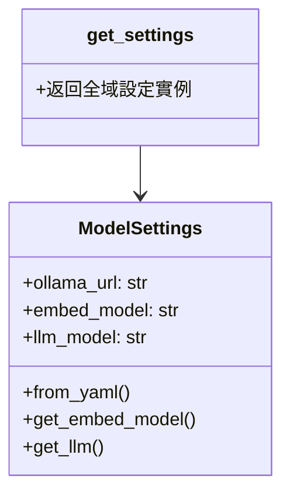

**核心檔案**:
- `settings.py`: ModelSettings 類別，載入 config.yml

---

### 2. 資料處理模組 (`src/data/`)

**職責**: 載入和處理 QA 資料集

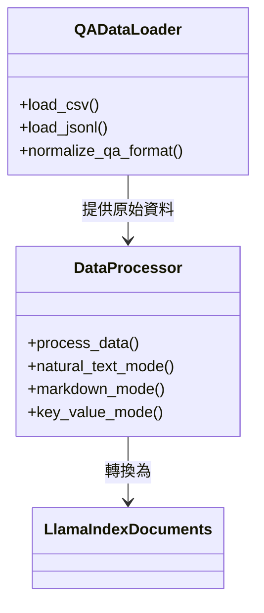

**核心檔案**:
- `loaders.py`: 資料載入器
- `processors.py`: 資料處理器

**支援格式**:
- CSV (舊格式)
- JSONL (新格式)

**支援模式**:
- natural_text
- markdown
- key_value_text
- unstructured_text

---

### 3. RAG 核心模組 (`src/rag/`)

#### 3.1 Wrappers 子模組 (`src/rag/wrappers/`)

**職責**: 統一封裝所有 RAG 方法

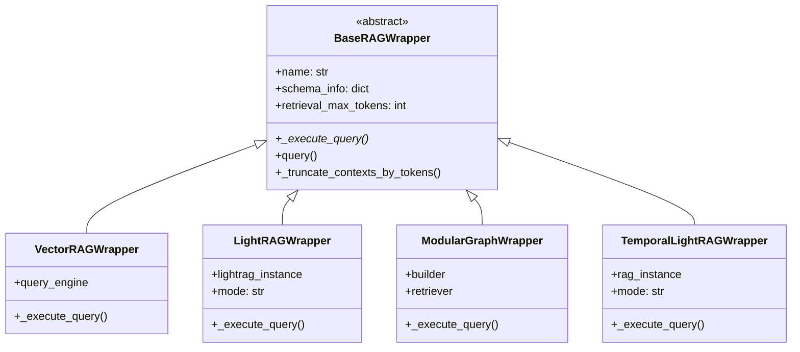

**Legacy（僅追溯，不從 `src.rag.wrappers` 匯出）**: `legacy/wrappers/autoschema_wrapper.py`、`legacy/wrappers/dynamic_schema_wrapper.py` 之 `AutoSchemaWrapper`、`DynamicSchemaWrapper`。

**統一功能**:
- ✅ 時間計算
- ✅ Token 統計
- ✅ 錯誤處理
- ✅ Context 截斷
- ✅ 標準化輸出

---

#### 3.2 Vector RAG 子模組 (`src/rag/vector/`)

**職責**: 向量檢索方法實作

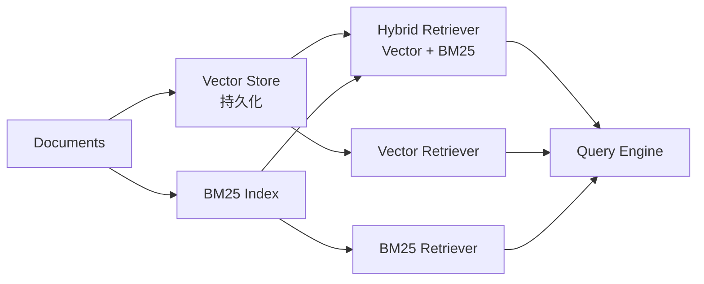

**實作方法**:
- `basic.py`: hybrid, vector, bm25
- `advanced.py`: self_query, parent_child

---

#### 3.3 Graph RAG 子模組 (`src/rag/graph/`)

**職責**: 圖譜檢索方法實作

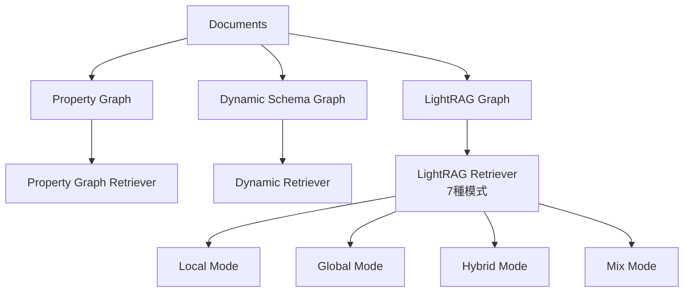

**實作檔案**:
- `property_graph.py`: PropertyGraph 方法
- `dynamic_schema.py`: DynamicSchema 方法
- `lightrag.py`: LightRAG 整合
- `lightrag_id_mapper.py`: Chunk ID 映射
- `autoschema_lightrag.py`: AutoSchemaKG
- `temporal_lightrag.py`: 時序 LightRAG

---

#### 3.4 Schema 管理子模組 (`src/rag/schema/`)

**職責**: Schema 生成和管理

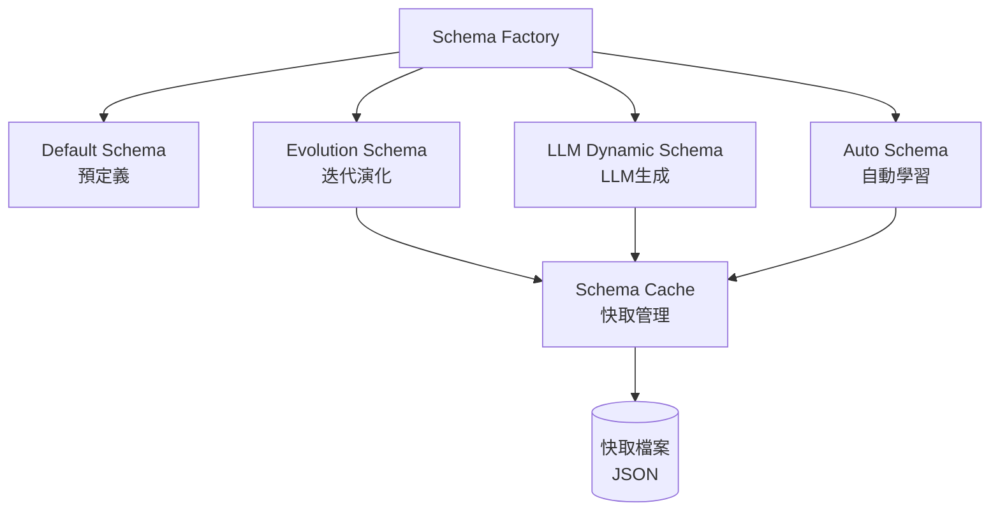

**核心檔案**:
- `factory.py`: Schema 工廠
- `schema_cache.py`: 快取管理
- `evolution.py`: 演化式生成
- `convergence.py`: 收斂檢測
- `entity_disambiguation.py`: 實體消歧

---

### 4. 模組化 Pipeline (`src/graph_builder/` + `src/graph_retriever/`)

**架構**: Builder + Retriever 分離設計

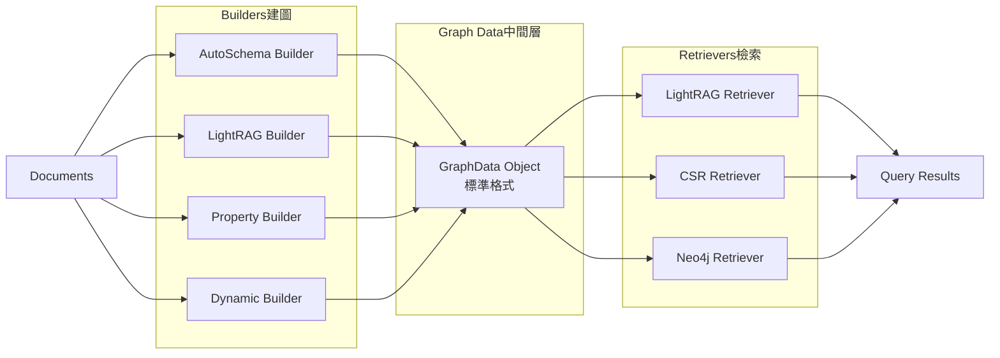

**註**：`neo4j` Retriever 於 `PipelineFactory.create_retriever` 尚未實作（`NotImplementedError`），圖示僅表示規劃介面。

**預設組合**:
1. AutoSchema + LightRAG
2. LightRAG + CSR
3. DynamicSchema + CSR
4. DynamicSchema + LightRAG

---

### 5. 評估系統 (`src/evaluation/`)

**職責**: 完整的評估指標計算和報告生成

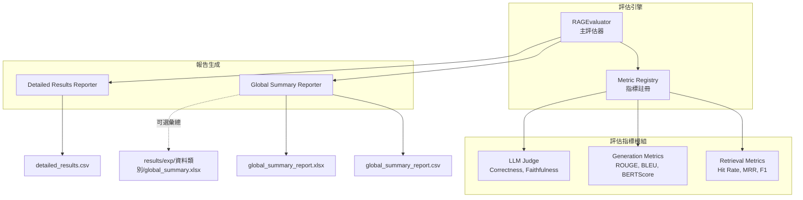

**指標類別**:
1. **檢索指標** (`metrics/retrieval.py`)
   - Hit Rate
   - MRR
   - Precision / Recall / F1

2. **生成指標** (`metrics/generation.py`)
   - ROUGE (1/2/L/Lsum)
   - BLEU
   - METEOR
   - BERTScore
   - Token F1 / Jieba F1

3. **LLM-as-Judge** (`metrics/llm_judge.py`)
   - Correctness (0-5)
   - Faithfulness (0/1)

---

### 6. 插件系統 (`src/plugins/`)

**職責**: 可擴展的 KG 增強功能

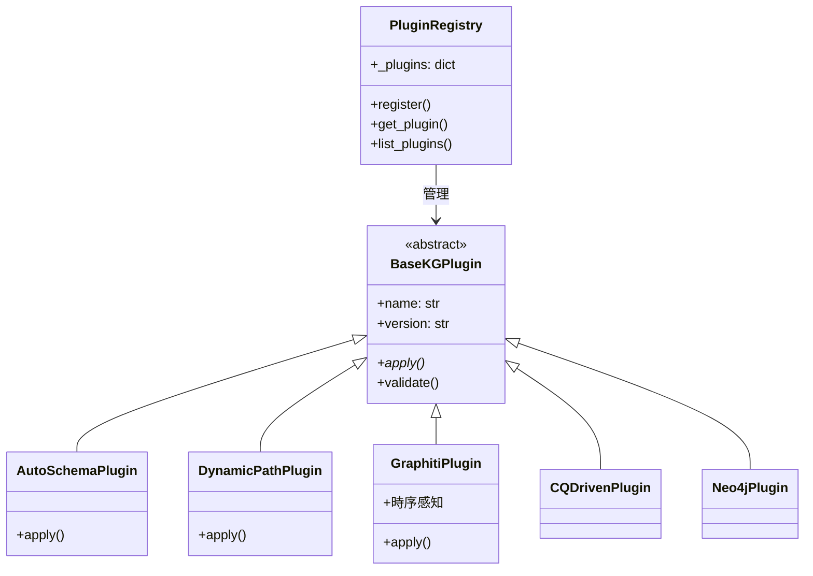

**已實作插件架構**:
- `autoschema_plugin.py`
- `dynamic_path_plugin.py`
- `graphiti_plugin.py`
- `cq_driven_plugin.py`
- `neo4j_builder_plugin.py`

**狀態**：`autoschema_plugin`、`dynamic_path_plugin` 可掛載於 LightRAG 流程；`graphiti_plugin`、`cq_driven_plugin`、`neo4j_builder_plugin` 多為占位或 TODO，與「已實作」模組分開看待。

---

### 7. 儲存管理 (`src/storage/`)

**職責**: 統一的 storage 目錄管理

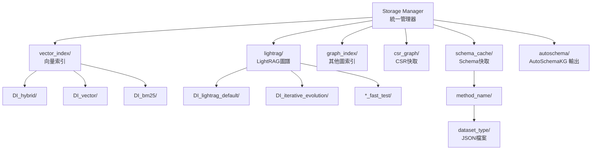

**目錄結構**:
```
storage/
├── vector_index/       # Vector 索引
├── graph_index/        # Graph 索引
├── lightrag/          # LightRAG 圖譜
├── autoschema/        # AutoSchemaKG；子目錄 slug = data_type[_data_mode][_sup][_fast_test]
├── csr_graph/         # CSR Graph 快取
├── cache/             # 其他快取
├── lightrag_temporal/ # 可選：Temporal LightRAG（config lightrag_storage_path_DIR）
└── schema_cache/      # Schema 快取
```

---

## 資料流圖

### 完整評估流程

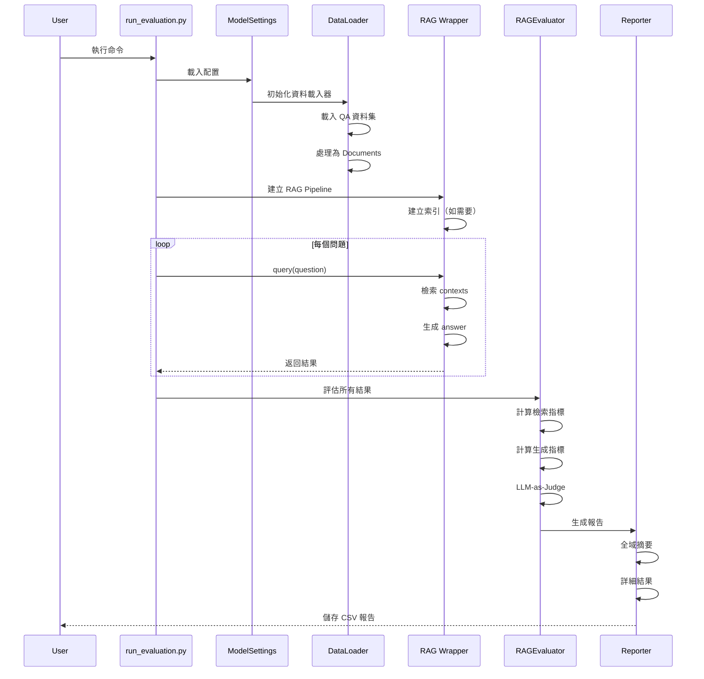

---

### Vector RAG 資料流

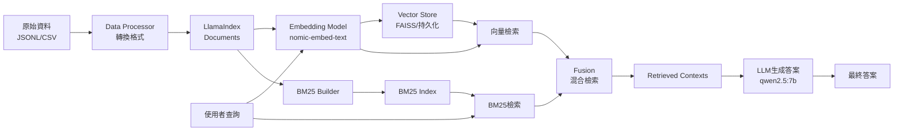

---

### LightRAG 資料流

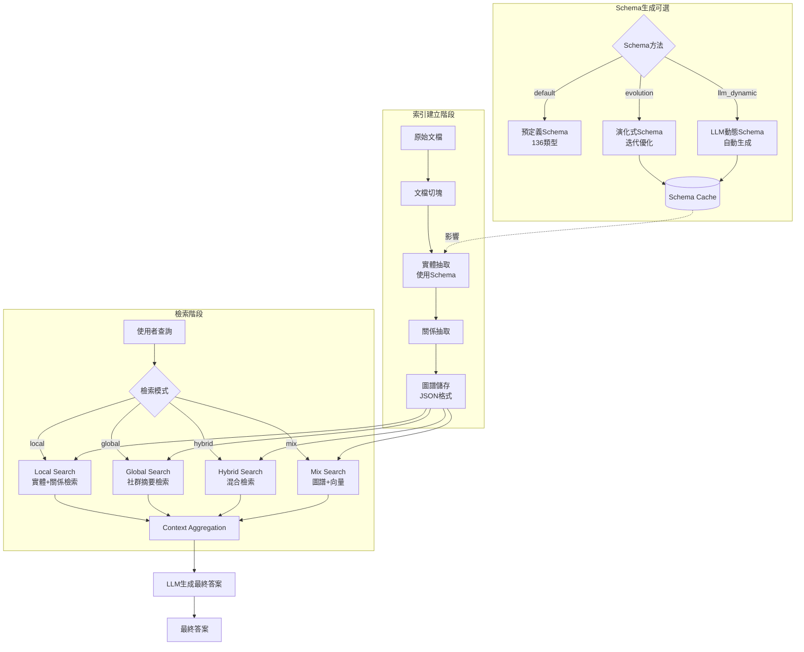

---

## 類別關係圖

### RAG Wrapper 繼承關係

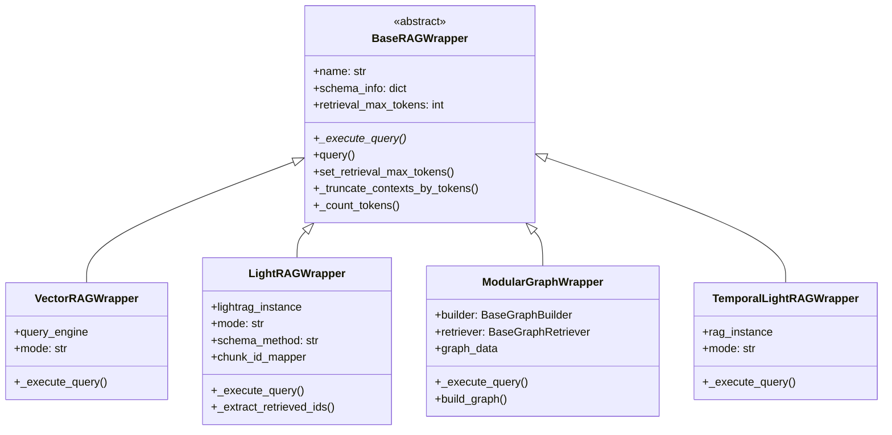

**Legacy**：`AutoSchemaWrapper`、`DynamicSchemaWrapper` 見 `legacy/wrappers/`。

---

### Builder-Retriever 關係

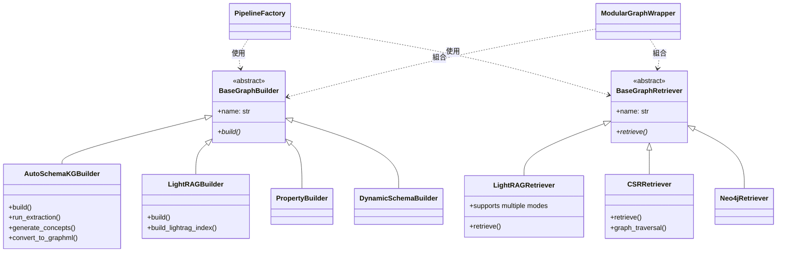

---

### 評估指標繼承關係

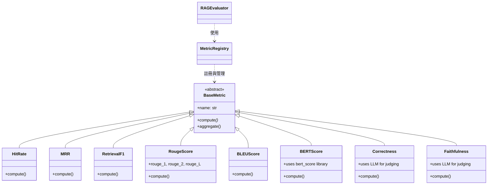

---

## 模組化 Pipeline 架構

### 設計理念

**實務上的三種 Graph 入口**（與 CLI 對照表一致）:
1. **LightRAG 端到端**：`--graph_rag_method lightrag`
2. **統一 Graph**：`--unified_graph_type property_graph` 或 `lightrag`（`UnifiedGraphBuilder` + `UnifiedGraphRetriever`）
3. **模組化**：`--graph_preset` 或 `--graph_builder` + `--graph_retriever`（`PipelineFactory`）

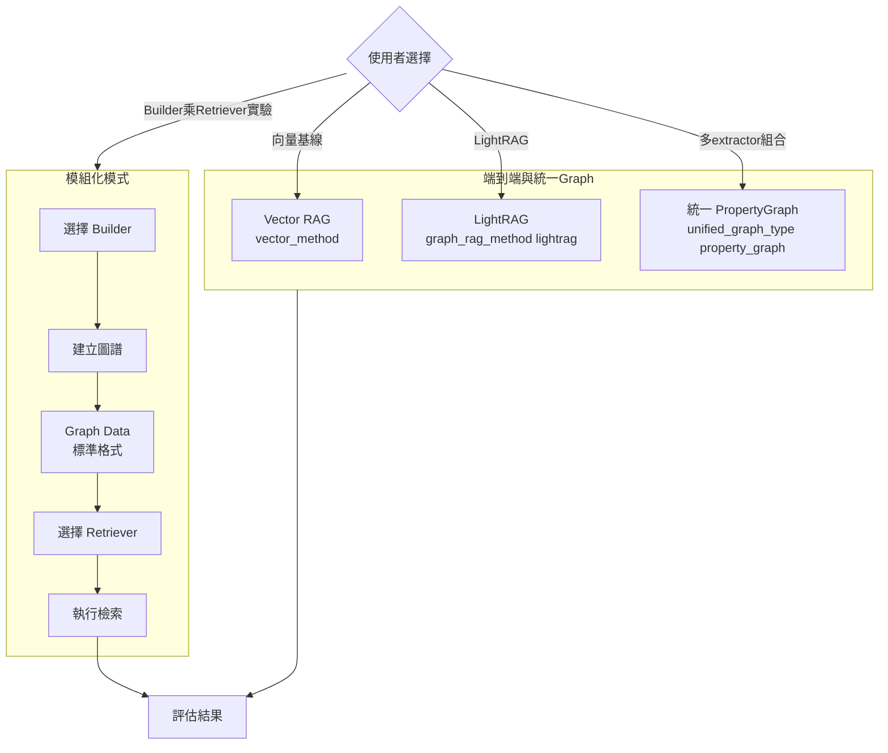

---

### PipelineFactory 運作機制

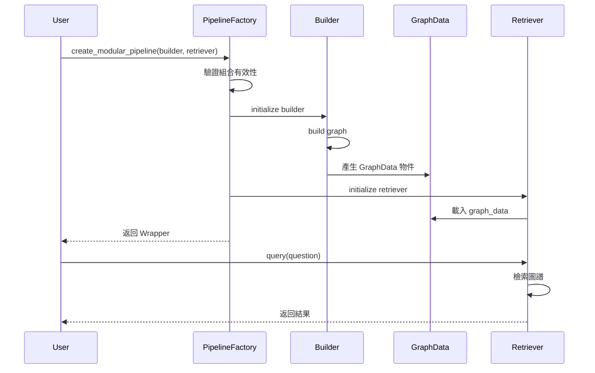

**預設組合表**:

| 組合名稱 | Builder | Retriever | 特點 |
|---------|---------|-----------|------|
| autoschema_lightrag | AutoSchemaKG | LightRAG | 自動 Schema + 強檢索 |
| lightrag_csr | LightRAG | CSR | LightRAG建圖 + 圖遍歷 |
| dynamic_csr | DynamicSchema | CSR | 動態Schema + 圖遍歷 |
| dynamic_lightrag | DynamicSchema | LightRAG | 動態Schema + LightRAG檢索 |

---

## 儲存管理架構

### Storage Manager 設計

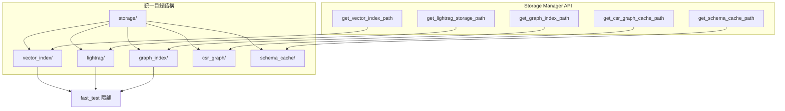

**設計優勢**:
1. ✅ 集中管理，避免路徑分散
2. ✅ 完整的 fast_test 隔離
3. ✅ 支援索引持久化
4. ✅ 自動目錄創建

---

## 評估系統架構

### 評估流程詳細設計

```mermaid
graph TB
    subgraph preparation[準備階段]
        LoadQA[載入 QA 資料集] --> InitWrapper[初始化 RAG Wrapper]
        InitWrapper --> BuildIndex[建立索引如需要]
    end
    
    subgraph execution[執行階段]
        BuildIndex --> QueryLoop[逐題查詢]
        QueryLoop --> CollectResults[收集結果]
    end
    
    subgraph evaluation[評估階段]
        CollectResults --> CalcRetrieval[計算檢索指標<br/>Hit Rate, MRR, F1]
        CollectResults --> CalcGeneration[計算生成指標<br/>ROUGE, BLEU, BERTScore]
        CollectResults --> CalcLLMJudge[LLM-as-Judge<br/>Correctness, Faithfulness]
        
        CalcRetrieval --> Aggregate[聚合指標]
        CalcGeneration --> Aggregate
        CalcLLMJudge --> Aggregate
    end
    
    subgraph reporting[報告階段]
        Aggregate --> GlobalReport[全域摘要<br/>CSV與XLSX]
        Aggregate --> DetailedReport[詳細結果<br/>detailed_results.csv]
        Aggregate --> TokenAnalysis[Token分析<br/>可選]
    end
```

---

### 指標計算流程

```mermaid
sequenceDiagram
    participant Evaluator as RAGEvaluator
    participant Registry as MetricRegistry
    participant Metric
    participant Results
    
    Evaluator->>Registry: get_metric("hit_rate")
    Registry-->>Evaluator: HitRate instance
    
    loop 每個問題
        Evaluator->>Metric: compute(ground_truth, retrieved)
        Metric-->>Evaluator: score
        Evaluator->>Results: 記錄分數
    end
    
    Evaluator->>Metric: aggregate(all_scores)
    Metric-->>Evaluator: 平均分數
    
    Evaluator->>Results: 寫入 CSV
```

---

## 擴展性設計

### 新增 RAG 方法

```mermaid
graph LR
    Step1[1. 實作 Wrapper<br/>繼承 BaseRAGWrapper] --> Step2[2. 實作 _execute_query]
    Step2 --> Step3[3. 註冊到 Factory]
    Step3 --> Step4[4. 添加 CLI 參數]
    Step4 --> Step5[5. 撰寫文檔]
    Step5 --> Complete[完成✓]
```

### 新增評估指標

```mermaid
graph LR
    Step1[1. 實作 Metric<br/>繼承 BaseMetric] --> Step2[2. 實作 compute 方法]
    Step2 --> Step3[3. 註冊到 Registry]
    Step3 --> Step4[4. 更新 Evaluator]
    Step4 --> Complete[完成✓]
```

### 新增插件

```mermaid
graph LR
    Step1[1. 實作 Plugin<br/>繼承 BaseKGPlugin] --> Step2[2. 實作 apply 方法]
    Step2 --> Step3[3. 註冊到 Registry]
    Step3 --> Step4[4. 測試整合]
    Step4 --> Complete[完成✓]
```

---

## 配置管理流程

```mermaid
graph TB
    ConfigYML[config.yml<br/>YAML配置檔] --> Parser[YAML Parser]
    Parser --> ModelSettings[ModelSettings 物件]
    
    ModelSettings --> OllamaConfig[Ollama 配置<br/>URL, 模型名稱]
    ModelSettings --> DataConfig[資料配置<br/>檔案路徑]
    ModelSettings --> LightRAGConfig[LightRAG 配置<br/>實體類型, 語言]
    ModelSettings --> StorageConfig[Storage 配置<br/>根目錄, 子目錄]
    ModelSettings --> SchemaConfig[Schema 配置<br/>快取, 方法]
    
    OllamaConfig --> LLM[LLM 實例]
    OllamaConfig --> EmbedModel[Embedding 模型]
    
    DataConfig --> DataLoader[資料載入器]
    LightRAGConfig --> LightRAGEngine[LightRAG 引擎]
    StorageConfig --> StorageManager[Storage Manager]
    SchemaConfig --> SchemaFactory[Schema Factory]
```

---

## 總結

### 架構優勢

1. **模組化設計**: 清晰的分層，職責分離
2. **可擴展性**: 抽象類別 + 工廠模式
3. **統一介面**: BaseRAGWrapper 提供一致 API
4. **多種 Graph 入口**: LightRAG 端到端、統一 PropertyGraph、模組化組合
5. **完整評估**: 多層次指標系統
6. **儲存管理**: 集中化、隔離化
7. **插件架構**: 靈活的功能擴展

### 技術棧總覽

| 層次 | 主要技術 |
|------|---------|
| LLM 後端 | Ollama (qwen2.5:7b/14b) |
| Embedding | nomic-embed-text, bge-m3 |
| 向量檢索 | LlamaIndex VectorStore, FAISS |
| 圖譜檢索 | LightRAG, PropertyGraph |
| 評估指標 | rouge-score, bert-score, sacrebleu |
| 資料處理 | pandas, numpy |
| 測試框架 | pytest |
| 非同步 | nest-asyncio |

### 關鍵設計模式

- **工廠模式**: PipelineFactory, SchemaFactory
- **策略模式**: 不同的檢索模式
- **裝飾器模式**: RAG Wrappers
- **觀察者模式**: 評估指標註冊
- **建造者模式**: Graph Builders

---

**最後更新**: 2026-03-21  
**專案路徑**: `/home/End_to_End_RAG`
